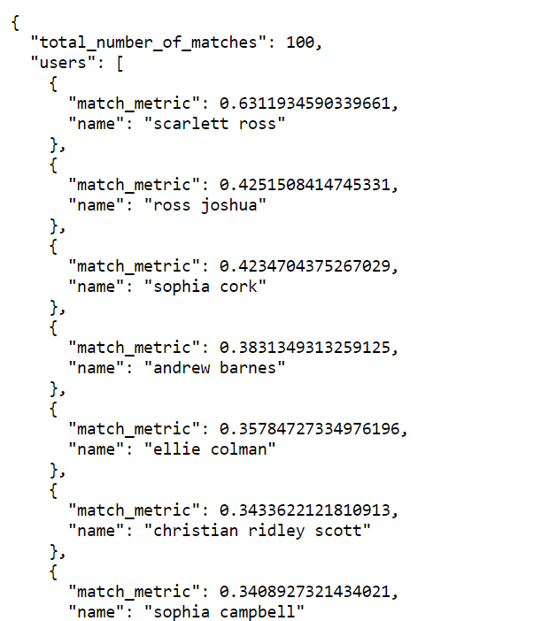
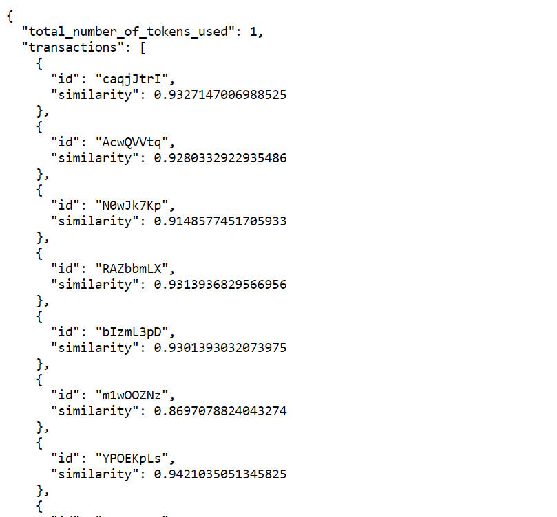

**paytrnapp App**
This is a Python application for managing transactions. It provides APIs for matching users and transactions based on transaction IDs and descriptions.

**Getting Started**
To run the paytrnapp, follow these steps:

**Navigate to the PayTransaction App Directory:**

* To run with a virtual environment :

* `python -m venv env`
* `.\env\Scripts\activate`

### **Run below command :**
* `cd paytrnapp`
* Install the required pip packages
* ` pip install -r requirements.txt
`
## **Run the App:**
* `cd bin`
* `python run.py`

This will start the application and make it available locally.

**APIs**
* Match Users API
Endpoint: `/api/match_users`
Parameters:
transaction_id: The ID of the transaction to match users against.
Example:

`http://127.0.0.1:5000/api/match_users?transaction_id=mkcUo5Z7`

* Match Transactions API
Endpoint: `/api/match_txns`
Parameters:
description: The description of the transaction to match against.
Example:
`http://127.0.0.1:5000/api/match_txns?description=ref%20ToCu6iXjX7jMACC//307338080372//CNTR%20From%20Hannah%20Wood%20for%20Deel`

**Additional Notes**

Make sure Python is installed on your system before running the application. (python version used : 3.12.1)
The application runs locally by default on http://127.0.0.1:5000

**To take the proof of concept (POC) of the paytrnapp to production and suggest improvements, here are the steps:**

## Infrastructure Setup:

Provision scalable infrastructure on a cloud provider like AWS, Azure, or GCP.

## Containerization:

Containerize the application using Docker for consistency and portability.

## Container Orchestration:

Utilize Kubernetes for container orchestration to manage scalability and reliability.

## Continuous Integration/Continuous Deployment (CI/CD):

Implement CI/CD pipelines with tools like Jenkins, GitLab CI, or GitHub Actions for automated testing and deployment.

## Security:

Implement security best practices, including encryption, access control, and vulnerability scanning.

## Monitoring and Logging:

Set up monitoring and logging using tools like Prometheus, Grafana, and ELK stack for real-time insights and troubleshooting.

## Auto Scaling:

Configure auto-scaling to handle fluctuations in traffic and ensure high availability.
## Database Management:

Use managed database services like Amazon RDS, Azure SQL Database, or Google Cloud SQL for database management.
## Data Backup and Recovery:

Implement regular data backups and disaster recovery strategies to prevent data loss.

## Load Balancing:

Utilize load balancers such as AWS ELB, Azure Load Balancer, or Google Cloud Load Balancing for distributing incoming traffic.

## Version Control:

Use version control systems like Git to manage code changes and collaborate with team members.

## Documentation:

Document deployment processes, architecture, and configurations for future reference.

## Performance Testing:

Conduct performance testing to identify and optimize bottlenecks for optimal performance.

## User Authentication and Authorization:

Implement user authentication and authorization mechanisms to secure access to the application.

## Global Availability:

Deploy the application across multiple regions for global availability and reduced latency.

## Cost Optimization:

Optimize resource usage and costs through right-sizing, reserved instances, and cost monitoring.

## Compliance:

Ensure compliance with industry standards and regulations such as GDPR, HIPAA, or PCI DSS.

## Backup Plan:

Have a rollback plan in place in case of deployment failures or unforeseen issues.

## Team Training:

Provide training to the operations team on managing and maintaining the production environment.

## Regular Updates:

Regularly update dependencies and components to address security vulnerabilities and improve performance.
